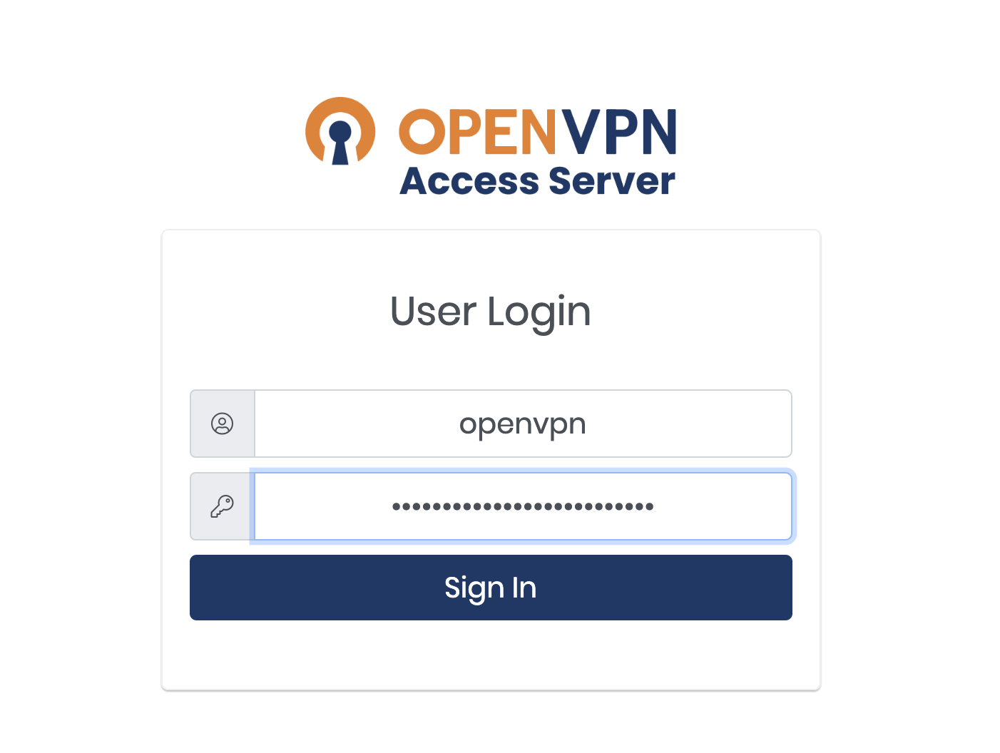
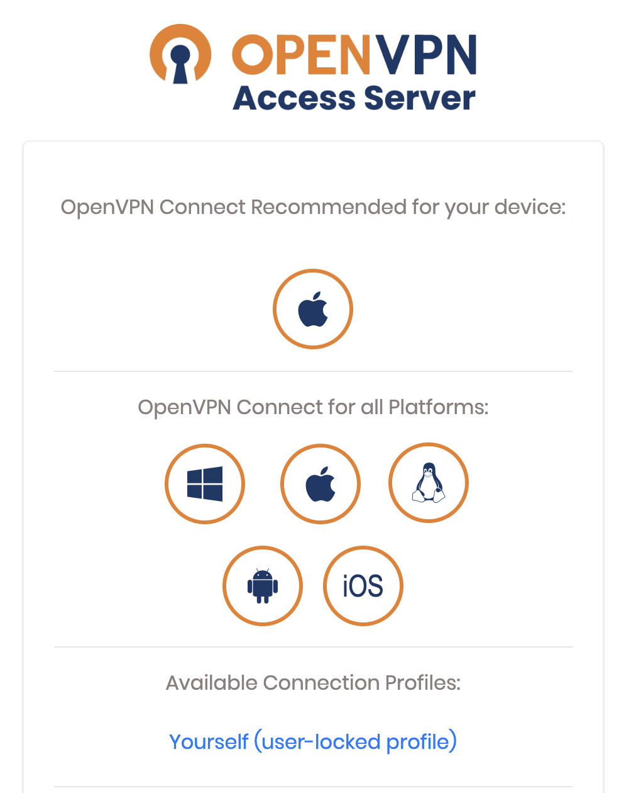
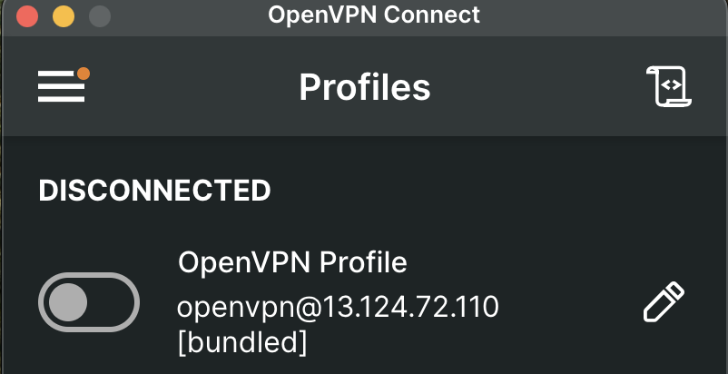
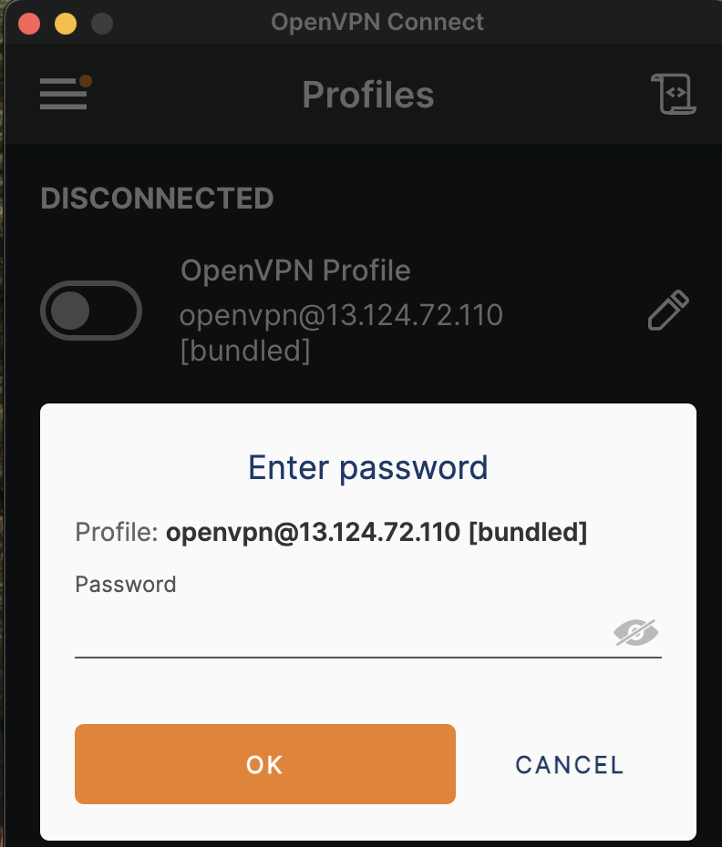

# 접속하는법
## Openvpn 설치
[Openvpn](https://13.124.72.110:943/)

- Username, Password 입력 후 다운로드
- 맨 위의 사과 모양 클릭클릭

## Openvpn 실행

- vpn connect -> 같은 패스워드 입력하시면 됩니다.
- 마무리되시면 아래 접속 주소로 들어가서 확인

[접속 주소](http://192.168.30.166/)